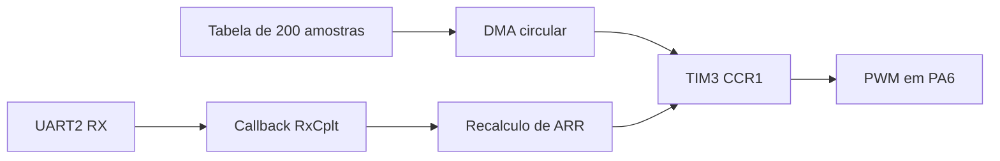
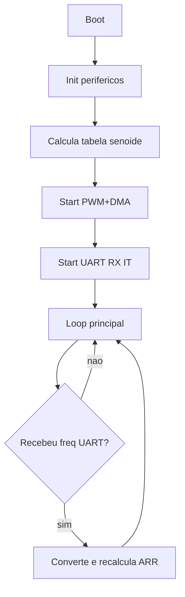
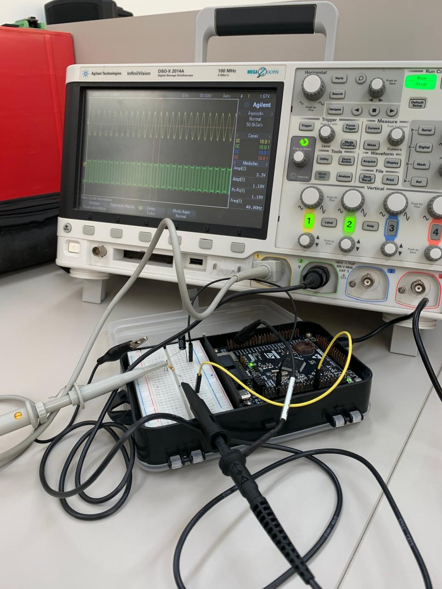

# Geração de Senoide por PWM + DMA com Controle de Frequência via UART

## Identificação

**Formação:** Sistemas Embarcados Virtus-CC  
**Curso:** Curso 2 - Periféricos  
**Docente:** Prof. D.Sc. Rafael Bezerra Correia Lima  
**Discente:** Vinicius Batista Duarte  
**MCU:** STM32F407VETx  
**Periféricos abordados:** TIM3 (PWM), DMA1, USART2, GPIO e NVIC  
**Versão:** 1.1 - 13 de Abril de 2026  
**Próximo passo:** validar faixa de frequência e robustez do parser UART

## Resumo

Este projeto implementa um gerador de senoide em STM32F407 usando PWM com atualização automática de duty cycle por DMA circular. A forma de onda é descrita por uma tabela de 200 amostras e aplicada em `TIM3_CH1 (PA6)`. A frequência da senoide pode ser alterada em tempo de execução por comando serial em `USART2`, sem interromper o fluxo principal de geração.


## 1. Motivação e problema

- gerar um sinal senoidal contínuo com baixo uso de CPU;
- permitir ajuste rápido de frequência por interface serial;
- manter arquitetura simples, robusta e fácil de expandir.

### Figura 1 - Contexto da aplicação

<p align="center">
  
</p>

## 2. Arquitetura da solução

O sistema utiliza três blocos principais:

1. **Tabela de senoide (200 amostras)** calculada no início da aplicação.
2. **TIM3 PWM CH1** para gerar o trem de pulsos com duty variável.
3. **DMA circular** para copiar continuamente as amostras para o registrador de compare do timer.

Configuração atual observada no projeto:

- `Prescaler = 23`
- `Period inicial = 199`
- `DMA1_Stream4`, `Channel 5`, modo circular, memória para periférico
- `USART2 @ 115200 8N1` para recepção de frequência em ASCII

### Figura 2 - Diagrama de blocos



## 3. Mapeamento de pinos

- `PA6` -> `TIM3_CH1` (saída PWM)
- `PA2` -> `USART2_TX`
- `PA3` -> `USART2_RX`

### Figura 3 - Ligação 

```text
STM32F407VETx                    Equipamento externo
--------------                   --------------------
PA6  (TIM3_CH1 PWM) -----------> Entrada de análise/filtro RC
GND                 -----------> GND comum
```

## 4. Modelo matemático e temporização

Para cada período da senoide, são usadas 200 amostras. A atualização da taxa de amostragem ocorre pela mudança de `ARR` no timer.

Fórmula aplicada no callback UART:

$$
ARR = \left(\frac{48\,000\,000}{(PSC+1)\cdot f\cdot N}\right) - 1
$$

Com os parâmetros atuais:

- $PSC = 23$
- $N = 200$
- $f =$ frequência alvo da senoide

Logo:

$$
ARR = \left(\frac{48\,000\,000}{24 \cdot f \cdot 200}\right) - 1
$$

Observação prática: o firmware atual não valida limites de `f`; entradas inválidas podem produzir `ARR` fora da faixa útil.

### 4.1 Filtro passa-baixa RC na saída PWM

Para reconstruir a senoide a partir do PWM em `PA6`, o circuito deve usar um filtro passa-baixa analógico.

Frequência de corte:

$$
f_c = \frac{1}{2\pi RC}
$$

Módulo e fase da resposta em frequência:

$$
\left|H(f)\right| = \frac{1}{\sqrt{1 + \left(\frac{f}{f_c}\right)^2}}
$$

$$
\angle H(f) = -\arctan\left(\frac{f}{f_c}\right)
$$

Atenuação em dB:

$$
A_{dB}(f) = 20\log_{10}\left|H(f)\right|
$$

No projeto atual, com `PSC = 23` e `ARR = 199`, a portadora PWM fica em:

$$
f_{PWM} = \frac{48\,000\,000}{(PSC+1)(ARR+1)} = \frac{48\,000\,000}{24\cdot 200} = 10\,000\,Hz
$$

Critério prático de dimensionamento para o laboratório:

- escolher `f_c` maior que a maior senoide de interesse para reduzir distorção do sinal útil;
- escolher `f_c` bem menor que `f_{PWM}` para atenuar componentes de comutação;
- regra de bolso: `f_senoide,max < f_c << f_{PWM}`.

Exemplo de projeto RC (1a ordem):

- adotando `f_c \approx 1 kHz` e `C = 100 nF`;
- então `R \approx 1/(2\pi f_c C) \approx 1.59 k\Omega` (valor comercial: `1.6 k\Omega`).

Com esse exemplo:

- em `50 Hz`, $|H| \approx 0.999$ (quase sem atenuação da senoide);
- em `10 kHz`, $|H| \approx 0.10$ (aprox. `-20 dB`, reduzindo ripple de PWM).

Observação: para rejeição mais forte da portadora, usar filtro de ordem maior (duas etapas RC ou ativo), mantendo a mesma lógica de dimensionamento de `f_c`.

### 4.2 Espaço para diagrama do filtro


<p align="center">
  
</p>


### 4.3 Valores calculados do filtro (laboratório)

| Parâmetro | Símbolo | Fórmula | Valor calculado | Unidade |
|---|---|---|---:|---|
| Clock do timer | $f_{TIM}$ | - | 48 000 000 | Hz |
| Prescaler | $PSC$ | - | 23 | - |
| Auto-reload (base) | $ARR$ | - | 199 | - |
| Frequência da portadora PWM | $f_{PWM}$ | $\frac{f_{TIM}}{(PSC+1)(ARR+1)}$ | 10 000 | Hz |
| Frequência de corte alvo | $f_c$ | escolha de projeto | 1 000 | Hz |
| Capacitor escolhido | $C$ | escolha de projeto | 100e-9 | F |
| Resistor calculado | $R$ | $\frac{1}{2\pi f_c C}$ | 1 591.55 | Ohm |
| Resistor comercial adotado | $R_{com}$ | arredondamento | 1 600 | Ohm |
| Constante de tempo | $\tau$ | $RC$ | 160e-6 | s |

Tabela de validação em bancada (preencher):

| Grandeza | Valor teórico | Valor medido | Erro (%) | Observação |
|---|---:|---:|---:|---|
| $f_c$ do filtro | 1 000 Hz | - | - | _Pendente_ |
| Atenuação em 50 Hz | -0.01 dB (aprox.) | - | - | _Pendente_ |
| Atenuação em 10 kHz | -20 dB (aprox.) | - | - | _Pendente_ |

## 5. Funcionamento do firmware

### 5.1 Inicialização

- configura clock do sistema;
- inicializa GPIO, DMA, TIM3 e USART2;
- calcula vetor de 200 pontos de senoide (`IV[200]`).

### 5.2 Geração contínua do sinal

- inicia `HAL_TIM_PWM_Start_DMA(...)` em `TIM3_CH1`;
- DMA atualiza o compare automaticamente em modo circular;
- CPU permanece livre no loop principal.

### 5.3 Ajuste dinâmico por UART

- `HAL_UART_Receive_IT(...)` recebe até 10 bytes;
- callback converte texto para float com `atof`;
- recalcula `ARR` e aplica por `__HAL_TIM_SET_AUTORELOAD`;
- reinicia recepção por interrupção.

### Figura 4 - Fluxo operacional



## 6. Estrutura do repositório

- `Core/Src/main.c`: lógica principal da geração e callback UART
- `Core/Src/stm32f4xx_hal_msp.c`: pinos, DMA e NVIC
- `Core/Src/stm32f4xx_it.c`: handlers de interrupção
- `Core/Inc/main.h`: cabeçalho principal
- `senoide-timer-uart.ioc`: configuração CubeMX
- `docs/images/`: imagens do README

## 7. Plano de testes e resultados

### 7.1 Teste funcional de geração

- **Objetivo:** verificar se o PWM em `PA6` segue variação senoidal de duty.
- **Procedimento:** observar PWM no osciloscópio e, opcionalmente, após filtro RC.
- **Critério de aprovação:** envelope compatível com senoide esperada.

#### Resultado

<p align="center">
  
</p>

### 7.2 Teste de ajuste de frequência via UART

- **Objetivo:** validar mudança de frequência em tempo real.
- **Procedimento:** enviar valores ASCII (ex.: `50`, `100`, `500`) no terminal serial.
- **Critério de aprovação:** período do sinal altera conforme comando recebido.

#### Resultado

<p align="center">
  
</p>

### 7.3 Teste de estabilidade

- **Objetivo:** verificar continuidade do sinal sem travamentos com atualizações sucessivas.
- **Procedimento:** enviar sequência de frequências durante 2 a 5 minutos.
- **Critério de aprovação:** sistema sem fault e sem perda de resposta UART.

#### Resultado

<p align="center">
  
</p>

Tabela de medição (preencher após bancada):

| Cenário | Frequência solicitada (Hz) | Frequência medida (Hz) | Erro relativo (%) | Observação |
|---|---:|---:|---:|---|
| Caso 1 | _50_ | _-_ | _-_ | _Pendente_ |
| Caso 2 | _100_ | _-_ | _-_ | _Pendente_ |
| Caso 3 | _500_ | _-_ | _-_ | _Pendente_ |

## 8. Trechos de código relevantes

### 8.1 Geração da tabela de senoide

```c
for (int i = 0; i < 200; i++) {
    angle = (float) i * ASR;
    IV[i] = (uint16_t) rint(100 + 99 * sinf(angle * (PI / 180)));
}
```

**Explicação:** gera 200 amostras com offset e amplitude adequados ao intervalo de compare usado no PWM.

### 8.2 Início da geração por PWM + DMA

```c
HAL_TIM_PWM_Start_DMA(&htim3, TIM_CHANNEL_1, (uint32_t *)IV, 200);
```

**Explicação:** inicia atualização automática do duty cycle com buffer circular de 200 amostras.

### 8.3 Callback UART para ajuste dinâmico

```c
void HAL_UART_RxCpltCallback(UART_HandleTypeDef *huart)
{
    if (huart->Instance == USART2)
    {
        rx_buffer[sizeof(rx_buffer) - 1] = '\0';
        freq = atof(rx_buffer);

        uint32_t arr = (48000000 / ((23 + 1) * freq * 200)) - 1;
        __HAL_TIM_SET_AUTORELOAD(&htim3, arr);

        HAL_UART_Receive_IT(&huart2, (uint8_t *)rx_buffer, sizeof(rx_buffer));
    }
}
```

**Explicação:** converte comando de frequência, recalcula o ARR e reaplica recepção por interrupção.

## 9. Conclusão

O projeto demonstra que é possível gerar senoide configurável em STM32F407 sem DAC dedicado, usando apenas `TIM3 + DMA + UART`. A abordagem reduz carga de CPU, facilita controle em tempo real e cria uma base sólida para evoluções como validação de protocolo, comandos mais robustos e melhor qualidade analógica na saída filtrada.
